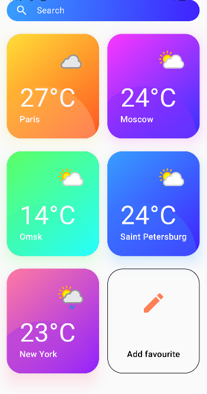
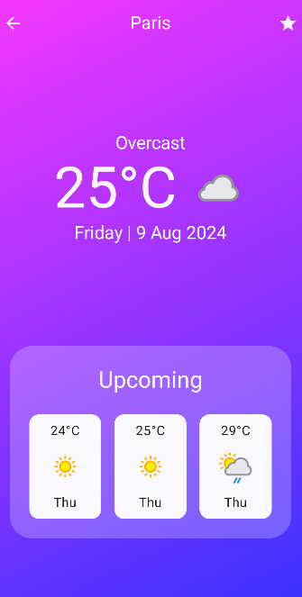
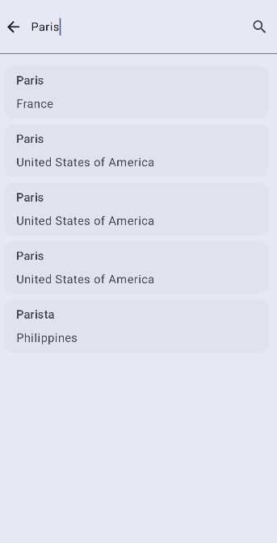

# Weather App
## Technology stack
The project uses Kotlin Multiplatform(decompose). The source code of the application was written in Kotlin. MVI was used as an architectural template. The room was used for data storage. Interaction with the network was implemented using Retrofit. The photos from the network were uploaded using Glide. Coroutine is used for asynchronous operation. Hilt was used to implement dependency injection. The application uses Jetpack Compose.
API: https://weatherapi.com/
## Screenshots

